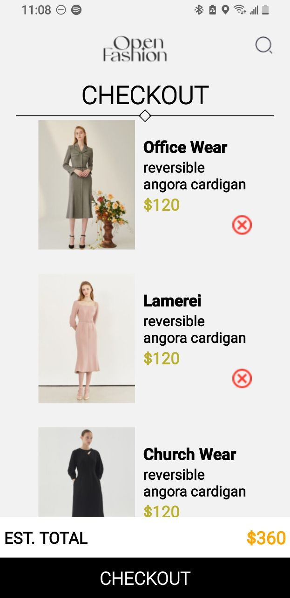

# DCIT 208 ASSIGNMENT 6

## Features Implemented

- Recreated the UI design as specified in the UI mockup.
- Implemented the following screens:
  - HomeScreen: Displays a list of available products.
  - CartScreen: Displays selected items in the cart.
- Added functionality for adding products to the cart.
- Added functionality for removing products from the cart.
- Used AsyncStorage to store selected items locally on the device.

## Screenshots

### Home Screen

.jpg>)


### Cart Screen



## Running the App

1. Clone the repository to your local machine.
2. Navigate to the project directory:
   ```bash
   cd rn-assignment4-11024002
   ```
3. Install the dependencies:
   ```bash
   npm install
   ```
4. Start the application:
   ```bash
   expo start
   ```
5. Use the Expo CLI to run the app on an iOS simulator, Android emulator, or physical device.
